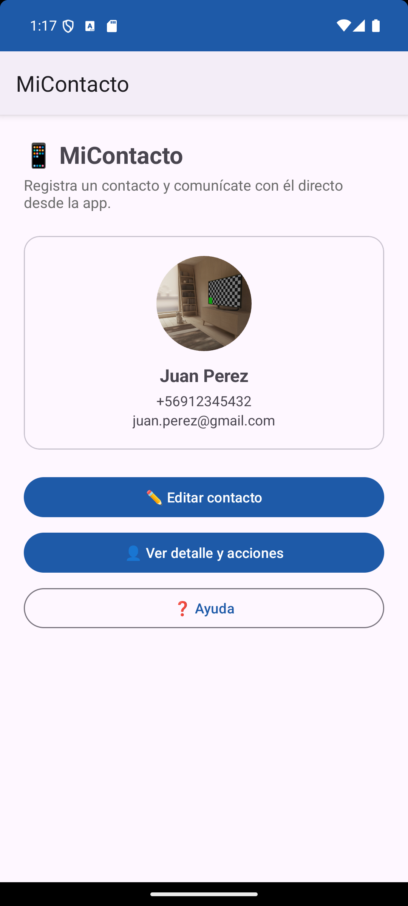
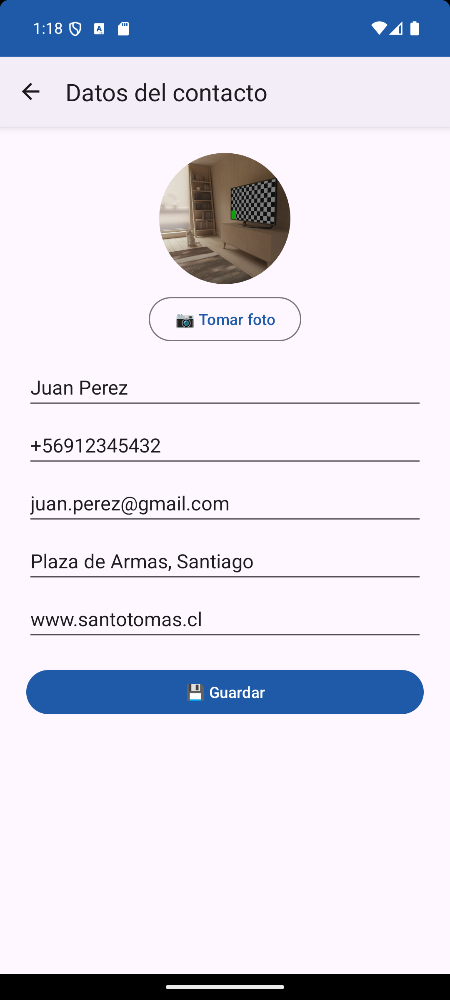
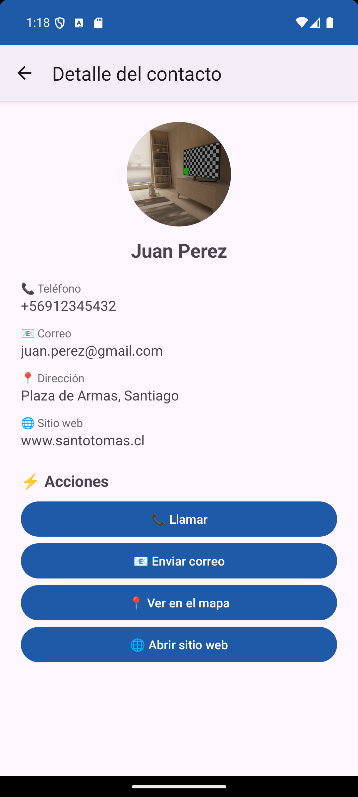
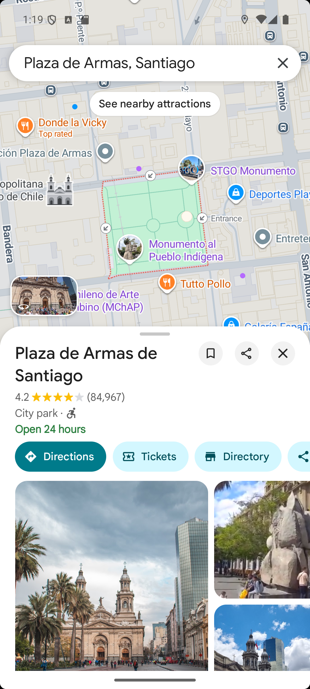

# 📱 MiContacto

Este es el segundo prototipo de mi app para Programación Android. La hice en Android Studio con Java y XML.

La app guarda un contacto con su nombre, teléfono, correo, dirección, página web y una foto. Después desde la misma app lo puedes llamar, mandarle un correo, ver la dirección en el mapa o entrar a su página. En esta entrega agregué los intents (5 implícitos y 3 explícitos) y validaciones para que la app no se caiga.

## 🛠️ Versiones

- Android Gradle Plugin (AGP): 8.11.1
- Gradle: 8.13
- compileSdk 36 y targetSdk 34
- minSdk 29 (Android 10), así puedo guardar la foto en la galería sin pedir permiso de almacenamiento
- Java 11

## 📲 Intents implícitos

Estos abren otras apps del celular:

1. 📞 Llamar (ACTION_DIAL): entrar al detalle del contacto y apretar "Llamar". Se abre el marcador con el número puesto, pero no llama solo.
2. 📧 Correo (ACTION_SENDTO con mailto): apretar "Enviar correo". Se abre la app de correo con el correo del contacto, un asunto y un mensaje.
3. 📍 Mapa (ACTION_VIEW con geo): apretar "Ver en el mapa". Se abre Google Maps buscando la dirección. Si el celular no tiene Maps, se abre en el navegador.
4. 🌐 Sitio web (ACTION_VIEW con https): apretar "Abrir sitio web". Si el contacto no tiene página, la app avisa.
5. 📷 Cámara (MediaStore.ACTION_IMAGE_CAPTURE): en el formulario apretar "Tomar foto". La primera vez pide permiso y la foto queda en la galería, en la carpeta Pictures/MiContacto.

## 🔁 Intents explícitos

Estos son para moverse entre las pantallas de la app:

1. 📝 De MainActivity a FormularioActivity: apretar "Registrar contacto", llenar los datos y guardar. El formulario se abre con registerForActivityResult() y devuelve los datos con setResult(), así el contacto aparece en el inicio.
2. 👤 De MainActivity a DetalleActivity: apretar "Ver detalle y acciones". Los datos se mandan con putExtra(). Si todavía no hay contacto, la app avisa que primero hay que registrar uno.
3. ❓ De MainActivity a AyudaActivity: apretar "Ayuda". Para volver está la flecha de arriba.

## ✅ Validaciones

- Nombre (mínimo 3 letras) y dirección obligatorios
- Teléfono entre 8 y 12 números, puede empezar con +
- Correo con formato válido
- Sitio web opcional, pero si se escribe tiene que ser válido
- Antes de abrir la cámara reviso que el celular tenga cámara y que esté el permiso
- Si se cancela la foto, borro el archivo vacío que quedaba en la galería
- Cuando vuelve el formulario reviso que venga RESULT_OK y que los datos no sean null
- Los intents implícitos tienen try/catch, si no hay una app para abrirlos sale un mensaje y la app no se cae

Además la foto se carga en un Thread aparte para que la pantalla no se pegue, y el contacto se guarda con SharedPreferences para que no se borre al cerrar la app.

## 📸 Capturas

   

## ▶️ Cómo probarlo

1. Descargar el repositorio (botón Code > Download ZIP) o clonarlo.
2. Abrirlo en Android Studio y esperar que termine el Gradle Sync. Si sale un error del JDK, elegir "Use Embedded JDK".
3. Correrlo en un emulador o celular con Android 10 o más. Para probar el correo es mejor un emulador con Google Play, porque trae Gmail.

El APK se genera en Build > Build App Bundle(s) / APK(s) > Build APK(s) y queda en app/build/outputs/apk/debug/app-debug.apk

## 🌿 Ramas

- main
- feature/intents (aquí trabajé este prototipo)

Benjamín Ramos - Ingeniería en Informática, Santo Tomás Santiago Centro
